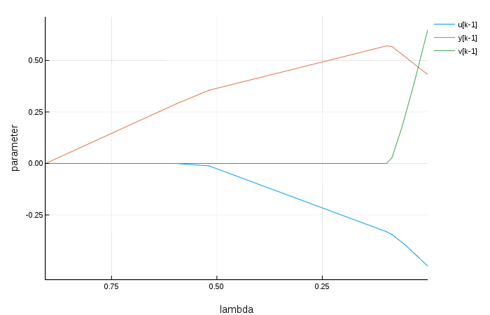

# NarmaxLasso

[](https://travis-ci.org/antonior92/NarmaxLasso.jl)
[](https://ci.appveyor.com/project/antonior92/narmaxlasso-jl)
[](https://coveralls.io/github/antonior92/NarmaxLasso.jl?branch=master)
[](http://codecov.io/github/antonior92/NarmaxLasso.jl?branch=master)

[](https://antonior92.github.io/NarmaxLasso.jl/latest)
[](https://antonior92.github.io/NarmaxLasso.jl/latest)

This package provides a method for computing the parameters of NARMAX
(*Nonlinear autoregressive moving average with exogenous inputs*)
models subject to L1 penalty using pathwise coordinate optimization algorithm.


## Installation

Within [Julia](https://julialang.org/downloads/), use the package manager:

```JULIA
julia> Pkg.clone("https://github.com/antonior92/NarmaxLasso.jl")
```

The package installation can be tested using the command:

```JULIA
julia> Pkg.test("NarmaxLasso")
```

## Documentation

View the [full documentation](https://antonior92.github.io/NarmaxLasso.jl/latest).

## Overview

This package allows the estimation of parameters of discrete dynamic models from observed data.

For instance, consider vectors of observed inputs and
outputs: ``u`` and ``y``. Assume, for instance, we want
to fit the following model to the observed data:
```
y[k] = β[1]*y[k-1] + β[2]*u[k-1] + β[3]*v[k-1]
```
this can be done by the following command sequence:
```JULIA
julia> using NarmaxLasso
julia> ny = 1; nu = 1; nv = 1; order = 1;
julia> mdl = generate_all(NarmaxRegressors, Monomial, ny, nu, nv, order)
    u[k-1]
    y[k-1]
    v[k-1]
julia> result = narmax_lasso(y, u, mdl);
```
Be ``e`` the error between the model prediction and the observed values,
the result of the above command sequence provides the solution of
the following minimization problem:
```
min_β ||e||^2 + λ * ∑ |β[i]|
```
for a grid of values of λ.

The output can be visualized using:
```JULIA
julia> using Plots
julia> plot(result)
```
A possible output would be:


Usually, the value of λ is chosen by testing on a validation set.

So far the above estimation procedure is implemented
only for linear and polynomial models. More options should
be included latter.

## Examples

Folder [``examples``](https://github.com/antonior92/NarmaxLasso.jl/tree/master/examples) contains two complete usage examples.
